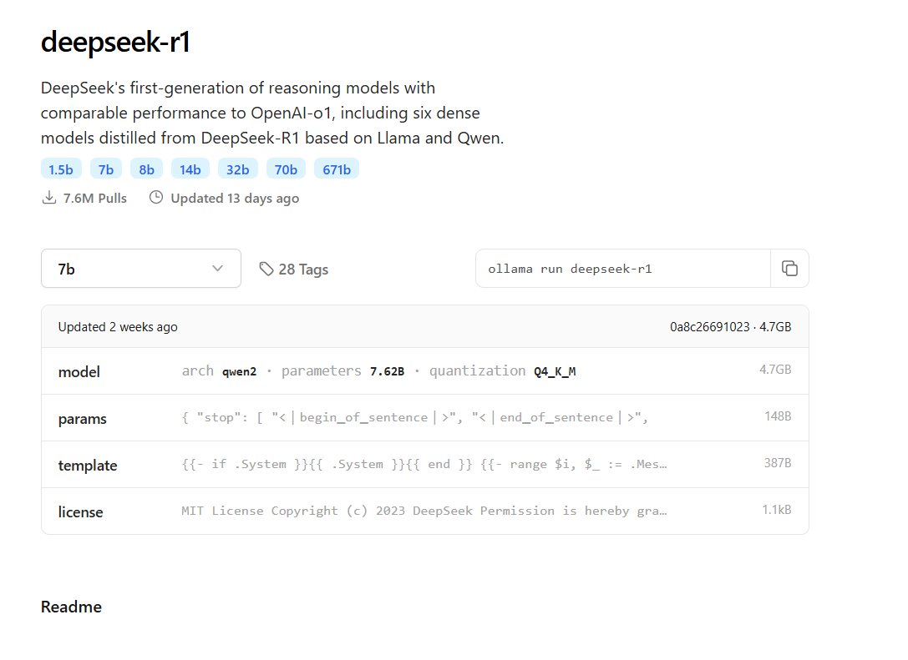

+++
date = '2025-02-04T08:07:24+05:30'
title = 'Deepseek AI: How to Run It Locally on Your PC in 10 Minutes'
author = 'Karthi Raja'
tags = ['AI', 'Deepseek', 'Chatbot', 'Local Chat']
categories = ['Tech', 'Tutorial']
email = 'karthikraja@gmail.com'
[cover]
image = 'cover-image.png'
alt = 'Deepseek AI'
+++

# Why Choose Deepseek AI?

Deepseek AI is a free, open-source AI-powered chatbot that functions similarly to ChatGPT. It is known for its efficiency, lightweight deployment, and affordability, making it a great open-source alternative to ChatGPT. Key advantages include:

- **Affordability**: Free and open-source, making it accessible to everyone.
- **Performance**: Focuses on reasoning and explainability.
- **Customizability**: Models can be fine-tuned for various applications.
- **Privacy**: Can be run locally without data leaving your machine.

## Getting Started with Installation

To run Deepseek AI locally, we need **Ollama**, a free and open-source tool designed for running large language models (LLMs) on personal computers with minimal effort.

### What is Ollama?

Ollama enables users to run LLMs on their local machines with better control and privacy. It supports downloading Deepseek AI models and other available models with ease.

## Step 1: Install Ollama

Download and install **[Ollama](https://ollama.com/)** from the official website. The installation process is straightforward and requires no advanced technical skills.


## Step 2: Download Deepseek AI Models

Once Ollama is installed, open **Ollama** or the command prompt and run the following command to download the Deepseek AI model:



For a **1.5 billion parameters** model, use:

```bash
ollama run deepseek-r1:1.5b
```

### Troubleshooting Common Errors

If you encounter the following error:

```bash
Error: Post "http://127.0.0.1:11434/api/show": An existing connection was forcibly closed by the remote host.
```

Make sure the Ollama server is running by executing:

```bash
ollama
```

Additionally, check that:

- You are running the command prompt or PowerShell **as an administrator**.
- The current directory has the necessary permissions to execute the command.

#### Example:

```bash
C:\Users\username>
```

Since my GPU VRAM is limited to **6GB**, I am using the **1.5B** model, which consumes up to **3GB of VRAM**.

If you want to download models with more parameters, refer to the official list **[here](https://ollama.com/library/deepseek-r1)**.

## Step 3: Verify Installation


To check if the installation was successful, run:

```bash
ollama  # Displays available commands
ollama ps  # Shows GPU VRAM and CPU usage
```

## Step 4: Running Deepseek AI Locally

Once installed, you can start interacting with the model by running:

```bash
ollama run deepseek-r1:1.5b
```

This command launches the AI model in the terminal. You can then enter messages, questions, or prompts, and Deepseek AI will generate responses accordingly.


## Exploring Other Deepseek AI Models

Deepseek AI offers models ranging from **1.5B** to **671B** parameters, depending on your system's capabilities. If your GPU supports higher VRAM, you can install larger models for improved performance.

These models are licensed under the **MIT License**, meaning they support commercial use, modifications, and derivative works. Additionally, they can be used for distillation in developing other AI models.

## Deepseek AI Model Training & Explanation

Deepseek AI models are trained on vast amounts of textual data, including books, articles, and websites. The AI is designed to generate human-like responses for a variety of use cases, making it a versatile tool for:

- Content creation
- Programming assistance
- Research support
- Customer service automation

## Final Thoughts

Deepseek AI is an excellent alternative to proprietary AI chatbots. With its lightweight nature and customizable models, it offers a powerful tool for individuals and businesses alike. By following these simple steps, you can start running Deepseek AI on your PC in your smartphone.

---

### 📌 **Additional Resources:**

- Official Deepseek AI Library: [Click Here](https://ollama.com/library/deepseek-r1)
- Ollama Installation Guide: [Click Here](https://ollama.com/)
- Deepseek AI GitHub Repository: [Click Here](https://github.com/deepseek-ai)
