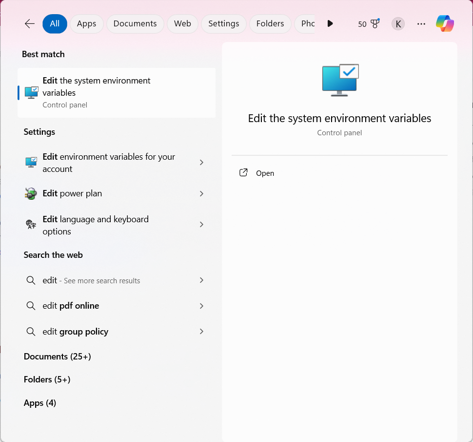
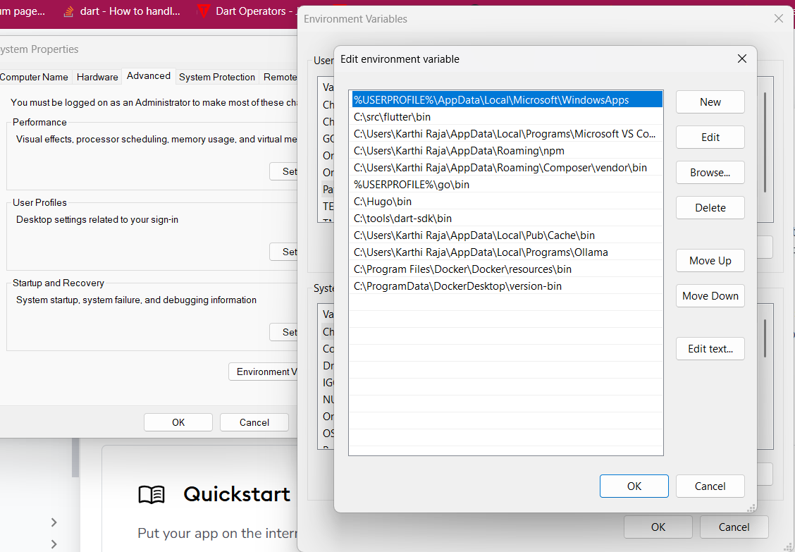
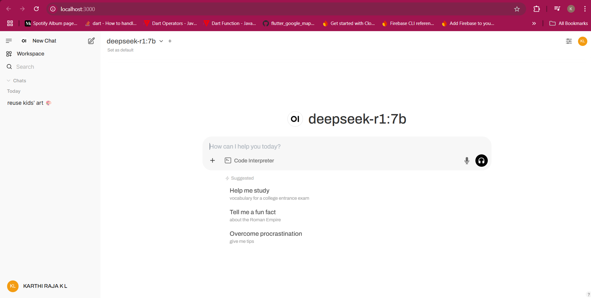

+++
date = '2025-02-04T08:07:24+05:30'
title = 'Deepseek AI: How to Run It Locally on Your PC with OpenWebUI and also use it in your smartphone?'
author = 'Karthi Raja'
tags = ['AI', 'Deepseek', 'Chatbot', 'Local Chat']
categories = ['Tech', 'Tutorial']
email = 'karthirajakl.98@gmail.com'
[cover]
image = 'cover-image.png'
alt = 'Deepseek AI in smartphone'
+++

## What is openwebui?

OpenWebUI is a web interface for running OpenAI's API locally. It allows you to interact with OpenAI's API without having to install any software on your computer. You can use it to run your own chatbots, generate images, and more.

## How to Run Deepseek AI Locally and run it in your smartphone via ngrok?

To run Deepseek AI locally, follow these steps:

1. Install Docker: You can download and install Docker from the official website. Once installed, you can verify the installation by running the following command in your terminal:

```
docker --version
```

If any error occurs, when checking the version, try editing your environment variables with the PATH variable.Usually it should be resolved by adding `C:/ProgramFiles/Docker/Docker/resources/bin`and `C:\ProgramData\DockerDesktop\version-bin` to the PATH variable.



Search for edit environment variables and click on it.



On the Popup window, click on Environment Variables and click on Path under User Variables.And edit the PATH variable to include the path of Docker.

```bash
C:/ProgramFiles/Docker/Docker/resources/bin


C:\ProgramData\DockerDesktop\version-bin

```

2. Pull the OpenWebUI image using docker:

```
docker run -d -p 3000:8080 --add-host=host.docker.internal:host-gateway -v open-webui:/app/backend/data --name open-webui --restart always ghcr.io/open-webui/open-webui:main
```

This should pull the OpenWebUI image from the GitHub repository and start the container.The -p flag specifies the port mapping, which in this case is 3000:8080. The --add-host flag is used to map the host's internal IP address to the container's host.The -v flag is used to mount a volume from the host to the container. In this case, it is mounted to the open-webui directory in the container.

Now the OpenWebUI container is running and you can access it at http://localhost:3000.

3.Now you could see it running locally on your pc.



## How to run Deepseek AI in your smartphone via ngrok?

1. Install ngrok: You can download and install ngrok from the official website.You can login and see the commands required to install ngrok either using chocolatey/brew install for your operating system. Once installed, you can verify the installation by running the following command in your terminal:

```
ngrok --version
```

2. After login go to Getting started and copy the config command with your auth token.

```
ngrok config add-authtoken <authtoken>
```

Then the auth token will be saved in a Local directory of ngrok.

3. Now run the following command to start the ngrok tunnel:

```
ngrok http http://localhost:3000
```

Make sure that the port number is 3000 in which the openwebui is running.You can configure ports in docker desktop for the openwebui container.

4. A link will be generated which will be used to access the openwebui in your smartphone.


Congratulations! You have successfully run Deepseek AI locally and also run it in your smartphone via ngrok.

---

### 📌 **Additional Resources:**

- Official OpenWebUI Documentation: [Click Here](https://github.com/open-webui/open-webui/blob/main/README.md)
- Official OpenWebUI GitHub Repository: [Click Here](https://github.com/open-webui/open-webui)
- ngrok Installation Guide: [Click Here](https://ngrok.com/docs)
