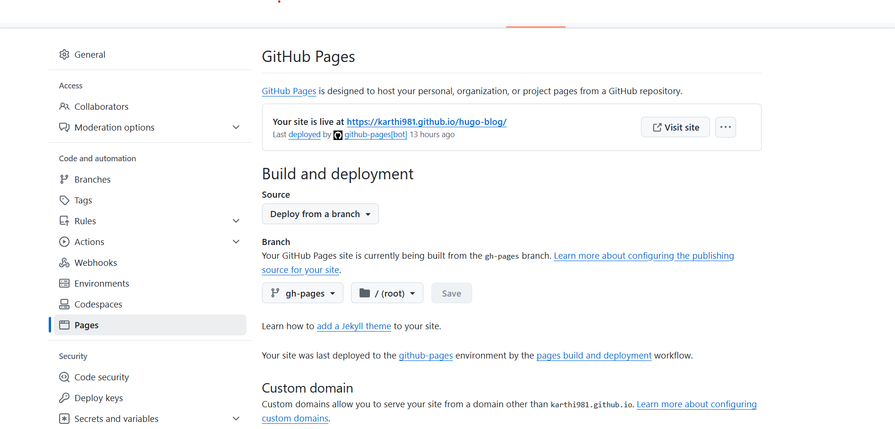

+++
date = '2025-01-30T12:07:24+05:30'
title = 'Hugo Deployment: Via Github pages and workflows'
author = 'Karthik Raja'
tags = ['Git', 'GitHub', 'GitHub Pages']
categories = ['Tech', 'Tutorial']
email = 'karthikraja@gmail.com'
+++

# Hugo Deployment: Via GitHub Pages and Workflows

Hugo is a powerful static site generator that allows you to create fast, customizable websites with ease. In this guide, we’ll walk through installing Hugo, setting up the PaperMod theme, and deploying your site to GitHub Pages using GitHub Actions.

---

## 1. Deploy to GitHub Pages

### **Step 0: Create a new branch in the repository**

Before setting up GitHub Actions, manually add the `gh-pages` branch to your repository. Otherwise, GitHub Actions will throw an error when trying to deploy.

1. Go to your GitHub repository.
2. Click on **Branches** and create a new branch named `gh-pages`.
3. Allow read and write permissions under **Settings > Actions > General > Workflow permissions**.

#### **Example Screenshot:**

(Upload an image here showing the **Actions tab** in repository settings with read & write permissions enabled.)

---

### **Step 1: Configure GitHub Actions to Publish to GitHub Pages**

#### **Initialize the Repository (If Not Already Done)**

Run the following commands to initialize your repository and push it to GitHub:

```sh
echo "# README" >> README.md
git add README.md
git commit -m "first commit"
git branch -M main
git remote add origin <path_to_your_git_repo>
git push -u origin main
```

---

### **Step 2: Create the GitHub Actions Workflow**

To automate the deployment process, create a workflow file:

1. In your repository, navigate to `.github/workflows/` (create these directories if they don’t exist).
2. Create a new file named `deploy.yml`.
3. Add the following workflow configuration:

```yaml
name: Publish to GH Pages
on:
  push:
    branches:
      - main
  pull_request:

jobs:
  deploy:
    runs-on: ubuntu-latest
    steps:
      - name: Checkout Repository
        uses: actions/checkout@v4
        with:
          submodules: recursive # Ensures submodules like themes are included
          fetch-depth: 0

      - name: Setup Hugo
        uses: peaceiris/actions-hugo@v2
        with:
          hugo-version: 'latest'
          extended: true

      - name: Build Site
        run: hugo --minify

      - name: Deploy to GitHub Pages
        if: github.ref == 'refs/heads/main'
        uses: peaceiris/actions-gh-pages@v3
        with:
          github_token: ${{ secrets.GITHUB_TOKEN }}
          publish_dir: ./public
          commit_message: "Automated deployment: $(date -u +'%Y-%m-%d %H:%M:%S')"
          force_orphan: true
```

---

### **Step 3: Enable GitHub Pages**

1. Go to your GitHub repository.
2. Navigate to **Settings > Pages**.
3. Under **Branch**, select `gh-pages` and click **Save**.



---

### **How This Workflow Works**

- **Trigger:** Runs on every `push` to `main` and on pull requests.
- **Checkout Repository:** Retrieves the repository code, including submodules (like themes).
- **Setup Hugo:** Installs Hugo’s latest extended version.
- **Build Site:** Runs Hugo to generate the static site.
- **Deploy:** Publishes the built site to the `gh-pages` branch using `peaceiris/actions-gh-pages`.
- **GitHub Pages Settings:** The `publish_dir: ./public` ensures only the public directory is deployed.

---

### **Final Notes**

- Ensure that `GITHUB_TOKEN` is available in **Settings > Secrets and variables > Actions**.
- If deployment fails, check **Actions > Workflows > Deploy** logs.
- Your site will be live at `https://<your-username>.github.io/<your-repo>`.

This setup enables continuous deployment, ensuring your Hugo site is always updated on GitHub Pages after every commit.
And you can easily update your site by pushing to the `main` branch. so you don't have to worry about manually updating the `gh-pages` branch.

Every time you push to the `main` branch, GitHub Actions will automatically deploy your site to GitHub Pages by installing Hugo, building your site, and publishing it to the `gh-pages` branch using the `peaceiris/actions-gh-pages` action.

---

By following these steps, you can efficiently deploy your Hugo site to GitHub Pages using automated workflows!
